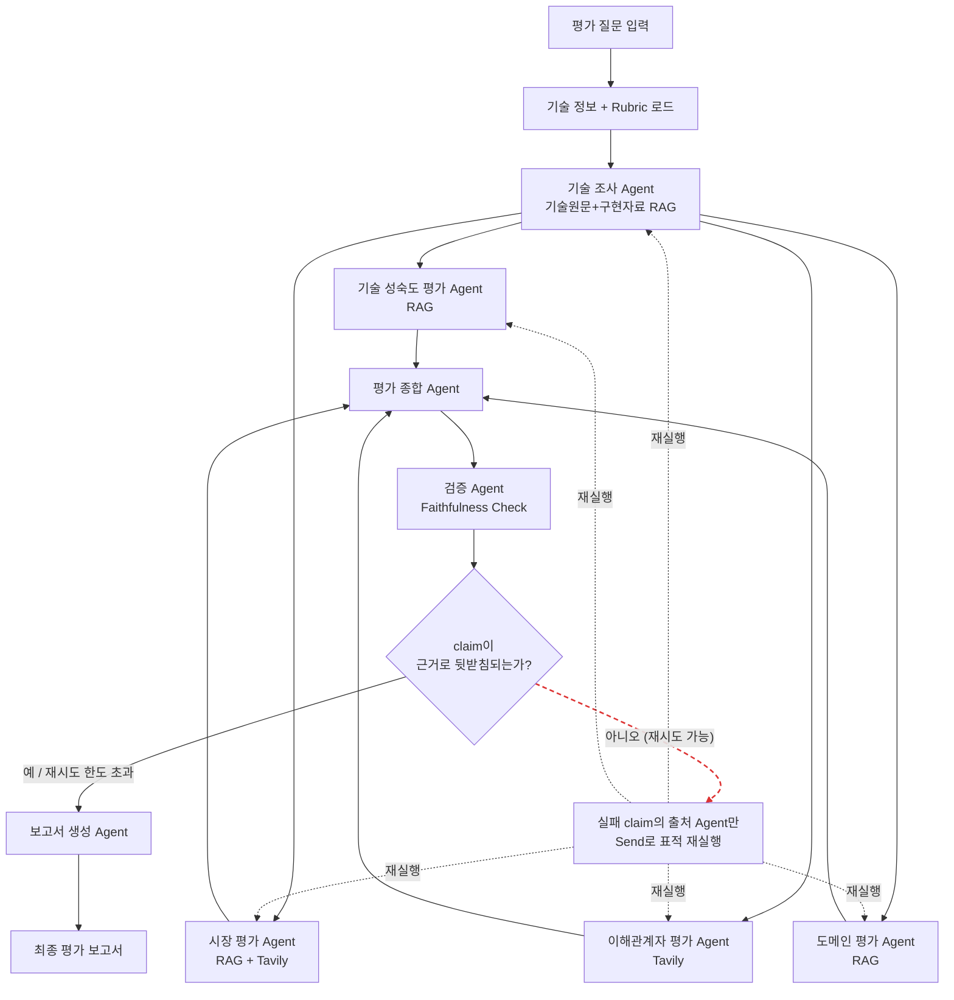

# Subject
본 프로젝트는 KV Cache 최적화 기술을 SW·HW 두 진영에서 선정(DeepSeek-V2 MLA, InfiniGen)하여,
기술 성숙도·시장성·이해관계자·장문맥 처리 애플리케이션 적용성 네 가지 관점에서 근거 기반으로
비교 평가하는 Multi-Agent RAG 시스템임. 상세 설계 근거는 [`sample.pdf`](./sample.pdf)
(RAG-Design 설계 문서)를 따름.


## Overview
- Objective : KV Cache 병목을 해결하는 서로 다른 접근(SW/HW)의 두 기술을 복수 관점에서 비교 평가
- Method : Multi-Agent(Distributed) + Agentic RAG (LangGraph 기반, 8개 Agent + Faithfulness 검증 루프)
- Tools : LangGraph, LangChain, OpenAI GPT, FAISS, BAAI/bge-m3, BAAI/bge-reranker-v2-m3, Tavily


## Selected Technologies
- SW : **DeepSeek-V2 Multi-head Latent Attention (MLA)** — Key/Value를 저차원 latent
  representation으로 공동 압축해 KV Cache 저장량을 93.3% 감소. 모델 아키텍처 수준에서 장문맥
  스케일링에 직접 대응.
- HW : **InfiniGen** — 호스트(CPU) 메모리에 KV Cache를 두고, 필요한 항목만 예측하여
  GPU로 선택적으로 프리페치하는 동적 오프로딩 기반 서빙 시스템. 메모리 계층·서빙 시스템 수준의 접근.

두 기술 모두 "컨텍스트 길이가 증가할 때 발생하는 KV Cache 병목"을 해결하지만 적용 수준이 다르므로,
논문 성능 수치를 직접 대결시키지 않고 해결 방식·메모리 효율·정확도 보존·지연·도입 난이도를 중심으로
비교함 (선정 사유 상세: `sample.pdf` A절 참고).


## Features
- 4종 코퍼스(기술 원문·공식 구현 README·장문맥 도메인 벤치마크·시장 자료) 기반 Hybrid RAG 검색
  (Dense + Sparse(RRF 결합) → Cross-encoder 재정렬), `doc_type`/`technology`로 Agent별 검색
  범위를 좁힐 수 있음
- 토큰 기준 청킹(약 500토큰/overlap 50) + 표·그림 캡션 별도 청크 분리
- 시장·이해관계자 평가 Agent는 Tavily 외부 검색 도구를 tool-calling으로 호출해 실시간 근거를
  보강 (검색 결과가 없으면 근거를 지어내지 않고 정직하게 "정보 부족"으로 처리)
- 4관점(기술 성숙도 / 시장성 / 이해관계자 / 장문맥 도메인 적합성) Rubric 기반 평가 — 근거가
  부족하면 점수·라벨을 억지로 매기지 않고 `정보 부족`으로 정직하게 표기
- 평가 종합 Agent가 관점 간 **일치점·상충점을 제거하지 않고 그대로 보고** → 확증 편향 방지 전략
  (특정 기술을 최종 승자로 선정하지 않음)
- 검증 Agent(Faithfulness Check)가 종합 결과의 claim을 근거(evidence_items)와 대조하고, 실패한
  claim의 **출처 Agent만 표적 재실행**(전체 재시작이 아님, 최대 `MAX_VERIFICATION_RETRIES`회)
- 최종 Markdown 평가 보고서 자동 생성 및 `outputs/`에 저장
- `tests/`에 네트워크·API 호출 없이 도는 재현 가능한 자동 테스트 스위트, Retrieval 품질(Hit@K,
  MRR) 평가, Generation 품질(Faithfulness, Answer Relevance) 평가 스크립트 포함


## Tech Stack
- Framework : LangGraph
- LLM/Generator : OpenAI GPT (`GENERATOR_MODEL`, 기본값 `gpt-5-mini`)
- LLM/Judge : OpenAI GPT (`JUDGE_MODEL`, Faithfulness Check 전용, 기본값 `gpt-5-mini`)
- Retrieval : FAISS(Dense) + BM25(Sparse) Hybrid Retrieval(RRF 결합, Top-20-30) →
  BAAI/bge-reranker-v2-m3 Cross-encoder 재정렬(Top-5-8). `doc_type`/`technology` 필터링 지원
- Embedding : BAAI/bge-m3 (다국어·긴 입력·Dense/Sparse 지원). 기본 연산 장치는 `cpu`(팀
  전체 호환), Apple Silicon 사용자는 `EMBEDDING_DEVICE=mps`로 개인 설정 시 GPU 사용 가능
  (아래 [MPS(Apple Silicon GPU) 사용](#mpsapple-silicon-gpu-사용) 참고)
- External Search : Tavily (`TAVILY_API_KEY`) — LangChain 공식 통합, 구조화된 JSON 반환,
  무료 티어로 팀 전원 재현 가능이라는 구조적 기준으로 팀이 선정

### RAG 코퍼스 구성
| `doc_type` | 문서 | 사용 Agent |
|---|---|---|
| `technical_paper` | DeepSeek-V2, InfiniGen 논문 | 기술 조사, 기술 성숙도, 도메인 평가 |
| `implementation_document` | 두 논문의 공식 GitHub README | 기술 조사, 기술 성숙도 평가 |
| `domain_benchmark` | LongBench, RULER 논문 | 도메인 평가 |
| `market_document` | Gemini API Long Context 공식 문서 | 시장 평가 |

`scripts/download_papers.py`의 `CORPUS_SOURCES`가 출처(URL)와 `doc_type`을 한 곳에서 관리하며,
`rag/ingest.py`가 색인 시 이 값을 그대로 청크 메타데이터에 남긴다.


## Agents
| Agent | 역할 | RAG | 외부 검색 | 입력 | 출력 |
|---|---|:---:|:---:|---|---|
| 기술 조사 Agent | 기술 원리·성능·한계 추출 | O (기술원문+구현자료) | - | 기술 논문 | `technical_evidence` |
| 기술 성숙도 평가 Agent | 공개 근거 기반 TRL(1-9) 추정 | O (기술원문+구현자료) | - | `technical_evidence` | `trl_evaluation` |
| 시장 평가 Agent | 시장 수요·상용화·생태계 조사 | O (시장자료) | O (Tavily) | `technical_evidence` | `market_evaluation` |
| 이해관계자 평가 Agent | 관계자별 이점·우려 분석 | X | O (Tavily) | `technical_evidence` | `stakeholder_evaluation` |
| 도메인 평가 Agent | 장문맥 처리 환경 적합성 평가 | O (기술원문+도메인자료) | - | `technical_evidence` | `domain_evaluation` |
| 평가 종합 Agent | 관점별 결과·충돌 지점 종합 | X | - | 4관점 평가 결과 | `synthesis` |
| 검증 Agent (Faithfulness Check) | claim-evidence 일치 대조, 근거 부족 탐지, 재시도 대상 Agent 판정 | X | - | `synthesis`, `evidence_items` | `faithfulness_check` |
| 보고서 생성 Agent | 결과를 보고서 형식으로 구성 | X | - | 종합·검증 결과, `references` | `final_report` |

TRL은 1-9 숫자 척도, 시장성·이해관계자·도메인 적합성은 "근거 부족 / 근거 제한적 / 근거 충분"
3단계 라벨을 쓴다(서로 다른 척도라 섞어 쓰지 않음). `TAVILY_API_KEY`가 없으면 외부 검색 도구가
등록되지 않아 해당 Agent는 검색 없이 정직하게 "정보 부족"으로 처리한다.


## Architecture


실패 시 **전체를 처음부터 다시 돌지 않는다** — `faithfulness_check`가 실패한 claim의 근거
(`evidence_items`)를 만든 Agent를 역추적해, 그 Agent(들)만 LangGraph `Send` API로 재호출한다.
`tech_research`가 재시도 대상이면 정적 엣지를 타고 하위 4개 Agent도 자연히 다시 실행되므로,
이 경우 하위 Agent는 중복 호출되지 않도록 재시도 목록에서 제외한다.

### PDF 설계와의 대응
`sample.pdf` D절 Graph 설계를 코드 노드로 그대로 옮기되, 순수 함수 하나로 표현 가능한 인접
단계는 하나의 LangGraph 노드로 합쳐 유지보수 단위를 줄였음.

| PDF 노드 | 구현 노드 (`graph/workflow.py`) |
|---|---|
| 평가 질문 입력 + 기술 정보·Rubric 로드 | `init` |
| 기술원문 RAG 검색 + 기술 조사 Agent | `tech_research` |
| 4관점 평가 Agent | `trl_evaluation` / `market_evaluation` / `stakeholder_evaluation` / `domain_evaluation` |
| 평가 종합 Agent | `synthesis` |
| 검증 Agent + 분기 | `faithfulness_check` + `route_after_faithfulness` (조건부 엣지, `Send` 기반 표적 재시도) |
| 보고서 생성 Agent | `report_writer` |


## Directory Structure
```
├── data/
│   ├── raw/                 # 원문(PDF/README/HTML) (scripts/download_papers.py로 생성, git 미포함)
│   ├── processed/           # BM25 검색용 청크 jsonl (rag/ingest.py로 생성, git 미포함)
│   └── eval/                # Retrieval/Generation 평가용 질문셋 (상세: tests/README.md)
├── vectorstore/              # FAISS 색인 저장 디렉터리 (git 미포함)
├── agents/                   # Agent 모듈 (8개)
│   ├── base.py                 # LLM 호출·프롬프트 로딩·외부 검색 tool-calling 루프·evidence 변환
│   ├── schemas.py               # Agent 구조화 출력 Pydantic 스키마
│   ├── tech_research.py
│   ├── trl_evaluation.py
│   ├── market_evaluation.py
│   ├── stakeholder_evaluation.py
│   ├── domain_evaluation.py
│   ├── synthesis.py
│   ├── faithfulness_check.py
│   └── report_writer.py
├── prompts/                  # Agent별 시스템 프롬프트 템플릿 (Rubric 포함)
├── rag/                      # RAG 파이프라인
│   ├── embeddings.py            # 임베딩 모델 + MPS 동시호출 락
│   ├── ingest.py                # 토큰 청킹, 표/캡션 분리, doc_type 태깅
│   ├── retriever.py             # Hybrid 검색 + doc_type/technology 필터 + 재정렬
│   └── external_search.py       # Tavily 등록 (agents.base.register_external_search_tool)
├── graph/                    # LangGraph State·워크플로우
│   ├── state.py                 # State 정의 + 중복 제거 리듀서
│   └── workflow.py               # 그래프 조립 + 표적 재시도 라우팅
├── scripts/
│   ├── download_papers.py    # 코퍼스 4종 다운로드 (CORPUS_SOURCES 단일 출처)
│   └── report_to_pdf.py      # report_*.md -> 제출용 RAG-Output PDF 변환
├── tests/                    # 재현 가능한 자동 테스트 + Retrieval/Generation 평가 (상세: tests/README.md)
├── assets/fonts/              # PDF 변환용 나눔고딕(OFL 라이선스) — git 포함
├── outputs/                   # 평가 결과(최종 보고서 .md, 제출용 .pdf) 저장 (git 미포함)
├── technologies.py            # 비교 대상 기술 메타데이터 (Human 선정 결과)
├── rubrics.py                 # evaluation_rubric State에 주입되는 구조화된 Rubric
├── config.py                  # 환경설정 (.env 로딩)
├── app.py                     # 실행 스크립트
├── pyproject.toml             # 의존성 정의 (uv 관리)
├── uv.lock                    # 잠금 파일 (uv 관리)
├── .env.example
└── README.md
```


## Usage
[uv](https://docs.astral.sh/uv/) 로 의존성·Python 버전을 관리함 (`.python-version`이 3.11을
고정하며, 로컬에 없으면 `uv`가 필요한 인터프리터를 자동으로 내려받음).

```bash
uv sync                             # .venv 생성 + 의존성 설치 (pyproject.toml/uv.lock 기준)

cp .env.example .env                # OPENAI_API_KEY, TAVILY_API_KEY 입력 필수

uv run python -m scripts.download_papers   # RAG 코퍼스(논문+README+벤치마크+시장문서) 다운로드
uv run python -m rag.ingest                # FAISS 색인 + BM25용 청크 생성

uv run python app.py                       # 기본 평가 질문으로 실행
uv run python app.py --question "..."      # 커스텀 질문으로 실행

uv run python -m scripts.report_to_pdf     # 최신 report_*.md -> 제출용 RAG-Output PDF 변환
```
실행 결과 최종 보고서는 콘솔에 출력되고 `outputs/report_{timestamp}.md`로 저장됨. 각 단계(Agent)
실행 시간도 `[timing]` 로그와 종료 시 요약 표로 함께 출력됨.

제출용 PDF(`RAG-Output_{캠퍼스}_{X반}_{이름들}.pdf`)는 `scripts/report_to_pdf.py`로 변환함 —
pandoc 등 시스템 설치 없이 `uv sync`만으로 동작(순수 Python + 리포에 포함된 나눔고딕 폰트).

`TAVILY_API_KEY`가 비어 있어도 실행은 되지만, 시장·이해관계자 평가는 외부 검색 없이 진행되어
근거가 부족하면 "정보 부족"으로 표시됨.

### 테스트
```bash
uv run python -m unittest discover -s tests -v   # 전체 테스트 (API 호출 없음, 네트워크 불필요)
```
실제 API를 쓰는 통합 테스트, Retrieval 품질(Hit@K/MRR) 평가, Generation 품질(Faithfulness/
Answer Relevance) 평가 실행법은 [`tests/README.md`](./tests/README.md)에 정리되어 있다.

### MPS(Apple Silicon GPU) 사용
기본값은 `EMBEDDING_DEVICE=cpu`다 — 팀 전체(비-Apple Silicon 포함)가 항상 같은 조건으로
재현할 수 있어야 하므로 공유 기본값은 바꾸지 않는다. Apple Silicon Mac에서 로컬 임베딩·재정렬
속도를 높이고 싶다면 **본인 `.env`에서만** 다음처럼 바꾸면 된다:
```bash
EMBEDDING_DEVICE=mps
```
과거에는 LangGraph가 여러 평가 Agent를 병렬로 실행할 때 reranker/embedding을 동시에 호출하면
PyTorch MPS 백엔드가 스레드 세이프하지 않아 세그폴트가 났다. 지금은 `rag/embeddings.py`의
`MODEL_CALL_LOCK`이 임베딩·재정렬 호출을 전역 직렬화해 동시 호출도 안전하다(4개 스레드 동시
호출 테스트로 확인). 다만 락으로 완전히 직렬화되므로, 그리고 전체 실행 시간의 병목이 로컬
연산이 아니라 OpenAI API 왕복 시간이라, **체감되는 전체 속도 향상은 크지 않을 수 있다** — 로컬
연산 자체(임베딩/재정렬 개별 호출)는 빨라지지만 파이프라인 전체 소요 시간을 크게 줄이지는
않는다.


## Contributors
- 전은배 : Agent 초안(v0.0) 설계 및 구현(State/Schema/Graph, 8개 Agent, 기술 문서 RAG
  파이프라인) — 이후 표적 재시도 라우팅, Tavily 외부 검색 도구 등록, MPS 동시성 버그 수정
- 박성우 : RAG 코퍼스 확장(구현 README·도메인 벤치마크·시장 문서 수집, 토큰 기반 청킹),
  외부 검색 tool-calling 공용 루프 설계, 재현 가능한 테스트 스위트 구축
- 서지원 : 기술 조사·기술 성숙도 평가 Agent 고도화(기술원문/구현자료 분리 검색, TRL 구간별
  정보 갭 반영)
- 최윤영 : 도메인 평가 Agent 고도화
- 이승준 : Retriever `doc_type`/`technology` 필터링, Cross-encoder를 `bge-reranker-v2-m3`로 업그레이드
- 박인애 : 시장 평가 Agent RAG 코퍼스 연동, 시장·이해관계자 프롬프트의 3단계 근거 라벨 정합화,
  보고서 REFERENCE 형식 정리
