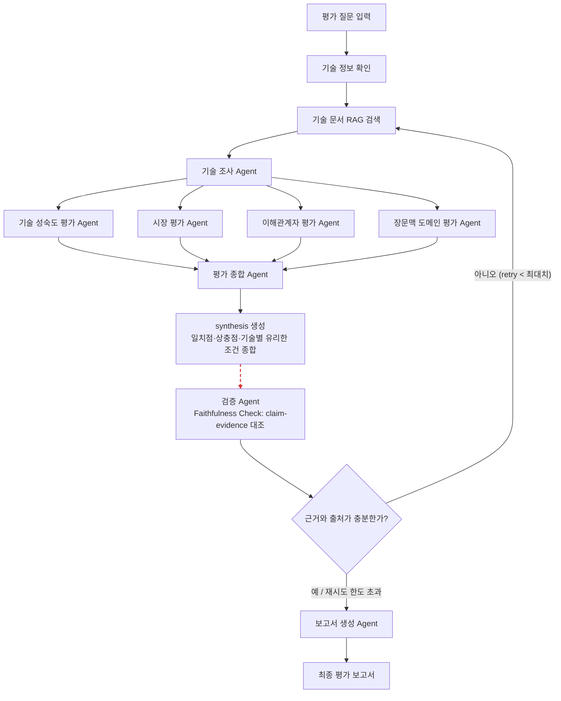

# Subject
본 프로젝트는 KV Cache 최적화 기술을 SW·HW 두 진영에서 선정(DeepSeek-V2 MLA, InfiniGen)하여,
기술 성숙도·시장성·이해관계자·장문맥 처리 애플리케이션 적용성 네 가지 관점에서 근거 기반으로
비교 평가하는 Multi-Agent RAG 시스템임. 상세 설계 근거는 [`초안3.pdf`](./초안3.pdf)
(RAG-Design 설계 문서)를 따름.


## Overview
- Objective : KV Cache 병목을 해결하는 서로 다른 접근(SW/HW)의 두 기술을 복수 관점에서 비교 평가
- Method : Multi-Agent(Distributed) + Agentic RAG (LangGraph 기반, 8개 Agent + Faithfulness 검증 루프)
- Tools : LangGraph, LangChain, OpenAI GPT, FAISS, BAAI/bge-m3, BAAI/bge-reranker-base


## Selected Technologies
- SW : **DeepSeek-V2 Multi-head Latent Attention (MLA)** — Key/Value를 저차원 latent
  representation으로 공동 압축해 KV Cache 저장량을 93.3% 감소. 모델 아키텍처 수준에서 장문맥
  스케일링에 직접 대응.
- HW·인프라 : **InfiniGen** — 호스트(CPU) 메모리에 KV Cache를 두고, 필요한 항목만 예측하여
  GPU로 선택적으로 프리페치하는 동적 오프로딩 기반 서빙 시스템. 메모리 계층·서빙 시스템 수준의 접근.

두 기술 모두 "컨텍스트 길이가 증가할 때 발생하는 KV Cache 병목"을 해결하지만 적용 수준이 다르므로,
논문 성능 수치를 직접 대결시키지 않고 해결 방식·메모리 효율·정확도 보존·지연·도입 난이도를 중심으로
비교함 (선정 사유 상세: `초안3.pdf` A절 참고).


## Features
- 기술 문서(arXiv 논문 PDF) 기반 근거 추출 + Hybrid RAG 검색 (Dense + Sparse → Cross-encoder 재정렬)
- 4관점(기술 성숙도 / 시장성 / 이해관계자 / 장문맥 도메인 적합성) Rubric 기반 평가 — 근거가 부족하면
  점수를 억지로 매기지 않고 `정보 부족`으로 정직하게 표기
- 평가 종합 Agent가 관점 간 **일치점·상충점을 제거하지 않고 그대로 보고** → 확증 편향 방지 전략
  (특정 기술을 최종 승자로 선정하지 않음)
- 검증 Agent(Faithfulness Check)가 종합 결과의 claim을 원문 근거와 대조, 불일치 시 자동 재검색
  루프 실행 (최대 `MAX_VERIFICATION_RETRIES`회, 무한 루프 방지)
- 최종 Markdown 평가 보고서 자동 생성 및 `outputs/`에 저장


## Tech Stack
- Framework : LangGraph
- LLM/Generator : OpenAI GPT (`GENERATOR_MODEL`, 기본값 `gpt-4.1-mini`)
- LLM/Judge : OpenAI GPT (`JUDGE_MODEL`, Faithfulness Check 전용, 기본값 `gpt-4.1-mini`)
- Retrieval : FAISS(Dense) + BM25(Sparse) Hybrid Retrieval(Top-20~30) → BAAI/bge-reranker-base
  Cross-encoder 재정렬(Top-5~8)
- Embedding : BAAI/bge-m3 (다국어·긴 입력·Dense/Sparse 지원)


## Agents
| Agent | 역할 | RAG | 입력 | 출력 |
|---|---|:---:|---|---|
| 기술 조사 Agent | 기술 원리·성능·한계 추출 | O | 기술 논문(RAG) | `technical_evidence` |
| 기술 성숙도 평가 Agent | 공개 근거 기반 TRL(1~9) 추정 | O | 기술 논문(RAG), `technical_evidence` | `trl_evaluation` |
| 시장 평가 Agent | 시장 수요·상용화·생태계 조사 | X¹ | `technical_evidence` | `market_evaluation` |
| 이해관계자 평가 Agent | 관계자별 이점·우려 분석 | X | `technical_evidence` | `stakeholder_evaluation` |
| 도메인 평가 Agent | 장문맥 처리 환경 적합성 평가 | O | 기술 논문(RAG), `technical_evidence` | `domain_evaluation` |
| 평가 종합 Agent | 관점별 결과·충돌 지점 종합 | X | 4관점 평가 결과 | `synthesis` |
| 검증 Agent (Faithfulness Check) | claim-evidence 일치 대조, 근거 부족 탐지 | X | `synthesis`, `retrieved_documents` | `faithfulness_check` |
| 보고서 생성 Agent | 결과를 보고서 형식으로 구성 | X | 종합·검증 결과, `references` | `final_report` |

¹ PDF 설계상 시장 평가 Agent는 RAG=O(공식 발표·산업 보고서 코퍼스)이지만, **v0.0에서는 RAG를
기술 문서 검색에만 한정**하여 시장 평가는 비-RAG로 구현함. 자세한 내용은
[실제 구현 범위 및 한계](#실제-구현-범위-및-한계-v00) 참고.


## Architecture


### PDF 설계와의 대응
`초안3.pdf` D절 Graph 설계(A~L)를 코드 노드로 그대로 옮기되, 순수 함수 하나로 표현 가능한 인접
단계는 하나의 LangGraph 노드로 합쳐 유지보수 단위를 줄였음.

| PDF 노드 | 구현 노드 (`graph/workflow.py`) |
|---|---|
| A(질문 입력) + B(기술 정보 확인) | `init` |
| C(RAG 검색) + D(기술 조사 Agent) | `tech_research` (자체적으로 RAG 검색 수행) |
| E/F/G/H(4관점 평가) | `trl_evaluation` / `market_evaluation` / `stakeholder_evaluation` / `domain_evaluation` |
| I(종합) + S(synthesis 생성) | `synthesis` |
| V(검증) + J(분기) | `faithfulness_check` + `route_after_faithfulness` (조건부 엣지) |
| K(보고서 생성) + L(최종 보고서) | `report_writer` |


## 실제 구현 범위 및 한계 (v0.0)
- **RAG는 기술 문서(DeepSeek-V2, InfiniGen 논문 PDF) 검색에만 사용함.** 기술 조사 / 기술 성숙도
  평가 / 도메인 평가 3개 Agent가 이 코퍼스를 공유해 검색한다.
- 시장 평가 Agent는 PDF 설계상 RAG=O(공식 발표·산업 보고서 코퍼스)이지만, 해당 코퍼스가 아직
  준비되지 않아 v0.0에서는 기술 조사 결과 + LLM의 일반 지식으로 판단하고, 그 한계를 출력의
  `limitations`/`confidence`에 명시하도록 프롬프트로 강제함.
- 이해관계자 평가 Agent는 PDF 설계상으로도 RAG=X이므로 그대로 구현함.
- 청크 분할은 문단 경계 근사(`RecursiveCharacterTextSplitter`) 수준이며, PDF가 언급한 "표 설명 /
  그림 캡션"을 별도 청크 타입으로 구분하지는 않음.
- 이 항목들은 팀원들이 v0.1 이후 시장·산업 자료 코퍼스 추가, 청크 전략 고도화 등으로 개선할 예정.


## Directory Structure
```
├── data/
│   ├── raw/                # 기술 문서 원본 PDF (scripts/download_papers.py로 생성, git 미포함)
│   └── processed/          # BM25 검색용 청크 jsonl (rag/ingest.py로 생성, git 미포함)
├── vectorstore/             # FAISS 색인 저장 디렉터리 (git 미포함)
├── agents/                  # Agent 모듈 (8개)
│   ├── base.py               # LLM 호출·프롬프트 로딩·문서 포맷 공통 유틸
│   ├── schemas.py             # Agent 구조화 출력 Pydantic 스키마
│   ├── tech_research.py
│   ├── trl_evaluation.py
│   ├── market_evaluation.py
│   ├── stakeholder_evaluation.py
│   ├── domain_evaluation.py
│   ├── synthesis.py
│   ├── faithfulness_check.py
│   └── report_writer.py
├── prompts/                 # Agent별 시스템 프롬프트 템플릿 (Rubric 포함)
├── rag/                     # RAG 파이프라인 (기술 문서 전용)
│   ├── embeddings.py
│   ├── ingest.py
│   └── retriever.py
├── graph/                   # LangGraph State·워크플로우
│   ├── state.py
│   └── workflow.py
├── scripts/
│   └── download_papers.py   # arXiv 원문 다운로드
├── outputs/                  # 평가 결과(최종 보고서 .md) 저장 (git 미포함)
├── technologies.py           # 비교 대상 기술 메타데이터 (Human 선정 결과)
├── config.py                 # 환경설정 (.env 로딩)
├── app.py                    # 실행 스크립트
├── pyproject.toml            # 의존성 정의 (uv 관리, git 미포함)
├── uv.lock                   # 잠금 파일 (uv 관리, git 미포함)
├── .env.example
└── README.md
```


## Usage
[uv](https://docs.astral.sh/uv/) 로 의존성·Python 버전을 관리함. (`.python-version`이 3.14를 고정하며,
`uv`가 없으면 필요한 인터프리터를 자동으로 내려받음)

```bash
uv sync                             # .venv 생성 + 의존성 설치 (pyproject.toml/uv.lock 기준)

cp .env.example .env                # OPENAI_API_KEY 입력 필수

uv run python -m scripts.download_papers   # 기술 문서 RAG 코퍼스 다운로드 (arXiv)
uv run python -m rag.ingest                # FAISS 색인 + BM25용 청크 생성

uv run python app.py                       # 기본 평가 질문으로 실행
uv run python app.py --question "..."      # 커스텀 질문으로 실행
```
실행 결과 최종 보고서는 콘솔에 출력되고 `outputs/report_{timestamp}.md`로 저장됨.


## Contributors
- 전은배 : Agent 초안(v0.0) 설계 및 구현 — LangGraph State/Graph 구현, 8개 Agent 구현, 기술 문서
  RAG 파이프라인(색인·Hybrid 검색·재정렬) 구현
- 서지원, 박성우, 최윤영, 이승준, 박인애 : 추후 Agent 개선 작업 참여 예정 (시장·산업 자료 RAG
  코퍼스 추가, 청크 전략 고도화, 프롬프트/Rubric 튜닝 등)
