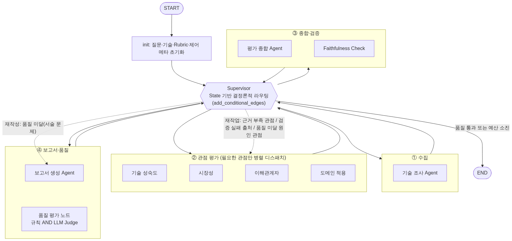
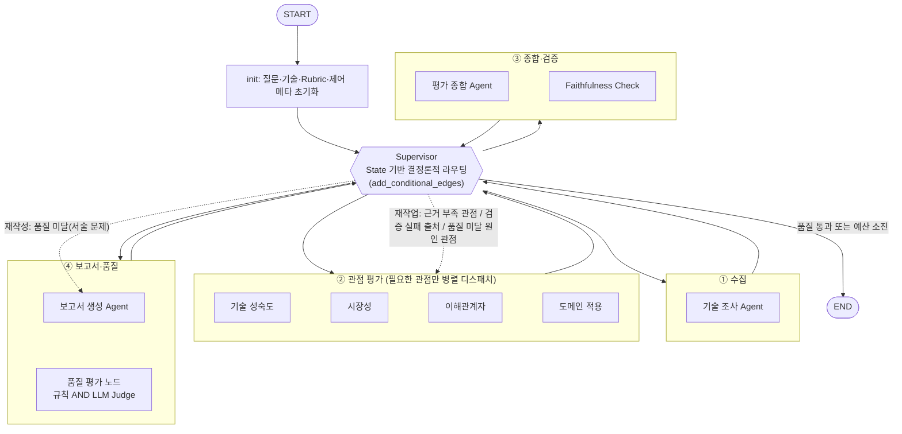

# Subject
본 프로젝트는 KV cache 최적화 기술을 소프트웨어(DeepSeek-V2 MLA), 하드웨어(InfiniGen) 두 진영에서
선정하여, 기술 성숙도·시장·이해관계자·도메인 관점에서 평가하는 **Supervisor 패턴** 기반으로
설계/개발 하는 프로젝트 임. 이전 RAG 과제(`main` 브랜치, 고정 순차·병렬 흐름)를 이 브랜치
(`agent/supervisor`)에서 동적 에이전트 패턴으로 재구성함.


## Overview
- Objective : 하나의 기술을 복수 관점에서 근거 기반으로 비교 평가 (우열 판정이 아님)
- Pattern : **Supervisor** — 보고서 생성의 핵심 위험이 "근거가 부족한 채로 결론을 쓰는 것"이므로,
  사전 계획을 병렬 분배하는 Orchestrator-Workers보다 **관점별 근거 충분도를 판정하고 부족한 관점만
  재조사시킨 뒤에야 보고서로 넘어가는** Supervisor가 목적에 맞음. 이전 RAG 버전이 이미 근거마다
  생성 Agent(`evidence_items.agent`)를 기록하고 있어, "어느 관점을 재작업시킬지"를 State만으로
  결정할 수 있다는 점도 선정 근거.
- 동적 처리 : 노드 순서가 그래프에 고정돼 있지 않다. 모든 하위 Agent는 Supervisor로만 돌아오고,
  Supervisor가 매 스텝 State(수집된 관점·근거 충분도·검증/품질 verdict·남은 예산)를 보고
  `add_conditional_edges`로 다음 노드를 고른다. 같은 코드라도 실행마다 경로가 달라진다 —
  예: 근거 부족 관점만 재작업 → 종합 재실행, 검증 실패 claim의 출처 Agent만 재작업, 품질 미달 시
  보고서 재작성, 실패 Agent 재시도/제외, 예산 소진 시 종료.
- 실제 실행 예 (run `1f4c1962`, `outputs/traces/{run_id}.jsonl`) : Supervisor 라우팅 **29회**, 재작업 **6회**.
  `collect_tech → collect_perspectives(4 병렬) → synthesize → verify → rework_unfaithful[tech_research]
  → (4관점 재수집) → … → rework_unfaithful[market, trl] → … → rework_unfaithful[domain] → write_report
  → evaluate_quality(FAIL: groundedness) → rework_quality[domain] → synthesize → verify → write_report
  → evaluate_quality(PASS) → END`. 고정 파이프라인이었다면 9노드 1회 실행으로 끝났을 흐름이 State 판정에
  따라 매번 다른 Agent 부분집합만 재실행됐다.


## Selected Technologies
- SW : **DeepSeek-V2 Multi-head Latent Attention (MLA)** — Key/Value를 저차원 latent로 공동 압축해
  KV Cache 저장량을 줄이는 모델 아키텍처 수준 접근.
- HW : **InfiniGen** — KV Cache를 호스트(CPU) 메모리에 두고 필요한 항목만 예측해 GPU로 선택적
  프리페치하는 메모리 계층·서빙 시스템 수준 접근.

두 기술 모두 "컨텍스트 길이 증가에 따른 KV Cache 병목"을 다루지만 적용 층위가 달라, 논문 수치를
직접 대결시키지 않고 조건별 차이를 정리한다.


## Features
- PDF·README·HTML 4종 코퍼스 기반 정보 추출 — Hybrid RAG(FAISS Dense + BM25, RRF) → Cross-encoder
  재정렬, `doc_type`/`technology` 필터로 Agent별 검색 범위 분리
- 시장·이해관계자 Agent는 Tavily 외부 검색을 tool-calling으로 호출해 실시간 근거 보강
- **Supervisor 근거 충분도 게이트** : **관점 × 기술** 단위로 근거 수(≥3)·출처 다양성(≥2종)·`insufficient_evidence`
  판정을 결정론적으로 계산해, 미달 관점에만 재작업 지시(`retry_hints`)를 내려보냄. Agent 합계로 세면
  한 기술의 근거가 다른 기술의 단일 출처 의존을 가리므로 기술별로 판정한다
  (예: 도메인 Agent가 기술마다 자기 논문 1편에만 의존 → 재작업 시 공식 구현자료까지 검색 범위 확장).
  Tavily만 쓰는 이해관계자 관점도 실제 트레이스의 `sufficiency.per_technology`에서
  DeepSeek-V2 MLA 근거 5건·출처 5종, InfiniGen 근거 10건·출처 8종으로 통과해 공통 기준을 유지함
- **Faithfulness Check** : 종합 claim을 근거와 대조, 실패 claim의 출처 Agent만 재작업 대상으로 Supervisor에 보고
- **Fall-back** : 하위 Agent 예외 → 1회 재시도 → 그래도 실패하면 **제외**하고 보고서에
  "정보 부족(실행 실패로 제외)"으로 표기 (병렬 실행 중 한 Agent가 죽어도 그래프는 계속)
- 확증 편향 방지 전략 : 관점 간 상충(conflicts)을 제거하지 않고 보고, 특정 기술을 승자로 선언하지 않음.
  품질 평가에서 단일 출처 편중(한 출처 > 근거의 50%), 외부 출처 미인용, 한쪽 기술 한계 누락을 미달로 판정
- **보고서 품질 평가 (Hybrid = 1안 + 2안)** : 보고서 생성 직후 필수 게이트. 4개 항목(Groundedness·
  중립성·편향 통제·관점 커버리지) 각각을 **규칙 판정 AND LLM Judge 판정**으로 결정하고, 분량(PDF 10쪽)·
  필수 목차(SUMMARY/REFERENCE)도 검사. 미달 시 원인이 근거면 해당 관점 재작업, 서술이면 보고서 재작성 루프
- 본문 모든 주장에 `[R#]` 인용 ID → REFERENCE와 1:1 연결 (규칙 기반 Groundedness 검사가 가능)
- 실행마다 `outputs/`에 보고서(`report_*_rev{n}.md`), 품질 verdict(`*.quality.json`), 결정 로그
  (`traces/{run_id}.jsonl`), 제출용 PDF(`Agent-Output_*.pdf`) 생성


## Tech Stack
- Framework : LangGraph (StateGraph + `add_conditional_edges` + SqliteSaver 체크포인트)
- LLM/Generator : OpenAI `gpt-5-mini` (`GENERATOR_MODEL`)
- LLM/Judge : OpenAI `gpt-5-mini` (`JUDGE_MODEL`, Faithfulness Check·품질 평가 Judge)
- Retrieval : FAISS(Dense) + BM25(Sparse) Hybrid(RRF, Top-25) → BAAI/bge-reranker-v2-m3 재정렬(Top-6)
  - Held-out 15문항 평가: **Hit Rate@1 0.533, Hit Rate@3 0.867, Hit Rate@5 0.867, MRR 0.678**
- Embedding : BAAI/bge-m3 (다국어·긴 입력·Dense/Sparse 지원)
- External Search : Tavily (LangChain 공식 통합, 구조화 JSON, 무료 티어 재현 가능)
- Observability : LangSmith (루트 run id = `run_id`) + 외부 JSONL 결정 로그


## Agents
- **Supervisor** (조정 계층, `graph/supervisor.py`) : 매 스텝 State(수집된 관점·근거 충분도·검증/품질
  verdict·남은 예산)를 읽고 다음 하위 Agent를 결정. 근거 충분도 게이트, 재작업 요청, 실패 Agent
  재시도/제외, 종료 판단 담당. 하위 Agent는 Supervisor와만 통신
- 기술 조사 Agent : 기술 원리·성능·한계 추출 (RAG: 기술 원문 + 공식 구현자료) → `technical_evidence`
- 기술 성숙도 평가 Agent : 공개 근거 기반 TRL(1-9) 추정 (RAG) → `trl_evaluation`
- 시장 평가 Agent : 수요·상용화·생태계 평가 (RAG 시장자료 + Tavily) → `market_evaluation`
- 이해관계자 평가 Agent : 관계자 유형별 이점·우려 분석 (Tavily) → `stakeholder_evaluation`
- 도메인 평가 Agent : 장문맥 처리 환경 적합성 평가 (RAG 원문 + LongBench/RULER) → `domain_evaluation`
- 평가 종합 Agent : 관점 간 일치·상충·기술별 유리 조건 정리 (우열 판정 없음) → `synthesis`
- 검증 Agent (Faithfulness Check) : 종합 claim을 근거와 대조, 실패 claim의 출처 Agent를 Supervisor에 보고 → `faithfulness_check`
- 보고서 생성 Agent : `[R#]` 인용을 포함한 보고서 작성, 품질 미달 시 피드백 반영 재작성 → `final_report`
- 품질 평가 노드 : 보고서 생성 후 Hybrid(규칙 AND LLM Judge) 4항목 + 분량 평가 → `quality_verdict`

Supervisor 자체는 LLM이 아닌 **결정론적 정책**이다. LLM 판정이 필요한 부분(claim 대조·보고서 품질)은
하위 노드가 구조화 verdict로 State에 남기고, Supervisor는 verdict + 예산으로만 분기한다 → 같은 State면
같은 라우팅(재현성), 모든 결정에 사유가 기록됨.


## State Schema
정의: [`graph/state.py`](graph/state.py) (설계 원칙이 모듈 docstring에 문서화되어 있음)

- 제어 vs 페이로드 분리 : `GraphState`를 두 블록으로 분리. 페이로드 = 관점별 결과·`evidence_items`·
  `references`·`synthesis`·`final_report`·`quality_verdict`. 제어 = `run_id`, `step_count/max_steps`,
  `next_nodes`, `last_decision`, `node_status`, `attempts`, `errors`, `rework_counts`, `retry_hints`,
  `sufficiency`, `faithfulness_rounds`, `report_revisions`, `quality_feedback`. Supervisor는 페이로드 본문을 해석하지 않고
  존재 여부·근거 수·출처 수·verdict 플래그만 읽는다. 재작업 지시(`retry_hints`)도 제어 필드라서, 대상 Agent가
  지시를 소비해 `done`이 되면 다음 스텝에서 Supervisor가 비운다(실패·중단 노드의 지시는 재시도·재개용으로 유지).
  하위 Agent가 직접 지우지 않는 것은 "하위 Agent는 제어 필드를 쓰지 않는다"는 통신 제약 때문이다.
- 관측성 위치 : 결정 로그 전문(step, action, targets, **reason**, 충분도 판정)은 State 밖
  `outputs/traces/{run_id}.jsonl`과 LangSmith로 보낸다 ([`graph/observability.py`](graph/observability.py)).
  State에는 최신 결정 1건(`last_decision`)만 덮어써서 트레이스의 supervisor 노드 출력에서도 사유가 보인다.
- 지속성 비용 : 이전 버전의 `retrieved_documents`(청크 원문 전체)를 State에서 제거. 근거는 300자로
  자른 `evidence_items`만 두고 리듀서가 매 병합마다 중복 제거 → State 한 건의 크기는 억제됨. 보고서 이력·verdict·PDF는
  파일로만 저장. 인용 카탈로그도 저장하지 않고 `references`에서 결정론적으로 재구성.
  - 실측(2026-10-07, 기본 질문 1회 실행) : 10스텝·재작업 1회 실행은 `outputs/checkpoints.sqlite`에 체크포인트
    22개·약 3.4MB, 15스텝·재작업 2회 실행은 32개·약 5.6MB가 쌓였다. State는 종료 시점에 약 216KB이며
    `evidence_items`(182건)가 113KB로 절반을 차지하고 `references` 18KB, `final_report` 15KB가 뒤를 잇는다.
  - 원인 : 큰 건 State가 아니라 **스냅샷 횟수**다. SqliteSaver는 superstep마다 변경분이 아니라 State 전체를 다시
    저장한다. Supervisor 1스텝 = 체크포인트 약 2개(supervisor + 하위 노드)이고 State는 단조 증가해 첫 평가 이후
    130~230KB이므로, 용량 ≈ 체크포인트 수 × 약 0.15~0.2MB로 스텝에 비례한다. `MAX_SUPERVISOR_STEPS=30`까지 가면
    체크포인트 약 60개로 12~14MB가 되며, 보고된 14MB와 같은 규모다(추정). 또 DB는 실행(thread)마다 누적되고 자동 정리되지 않는다.
  - 대응 : 재작업 예산(`MAX_REWORK_PER_AGENT`, `MAX_FAITHFULNESS_ROUNDS`)과 스텝 상한이 곧 크기 상한이다. 완료된
    실행은 마지막 체크포인트만 남기고 지우면 DB 사본 시뮬레이션 기준 약 0.23MB(약 93% 감소)로 줄며, 재개가 필요 없어진
    실행에만 적용한다(진행 중 실행을 지우면 `--resume` 불가). 수동 정리는 `sqlite3 outputs/checkpoints.sqlite
    "delete from checkpoints where thread_id='<run_id>'; delete from writes where thread_id='<run_id>'; vacuum;"`.
    DB는 git에 포함되지 않는 산출물이므로 제출 전에 삭제해도 된다.
- 상관 : `run_id` 하나가 SqliteSaver `thread_id`, LangSmith 루트 run id·metadata, 결정 로그 파일명을
  모두 잇는다. 콘솔 첫 줄에 `run_id`가 출력된다.
- 재개/복구 : `node_status`(pending/running/done/failed/excluded) + `attempts` + `errors`가 재개에
  필요한 최소 상태. 체크포인트는 `outputs/checkpoints.sqlite`에 저장되고 `python app.py --resume <run_id>`로
  마지막 superstep부터 재개 (중단 시 `running`이던 노드는 다시 실행).
  - 검증(2026-10-07) : ① 관점 4개 병렬 평가 중 Ctrl+C → `--resume`로 이어서 보고서·품질 PASS까지 완료(10스텝).
    병렬 스레드가 끝날 때까지 기다린 뒤 종료돼 Ctrl+C 후 프로세스가 내려가기까지 8초 넘게 걸리고(정확한 시간은 미측정),
    그때까지 끝난 노드의 결과는 체크포인트에 저장돼 재개 시 step 3(synthesis)부터 이어진다. ② 같은 구간에서 SIGKILL로
    강제 종료 → `--resume`은 미완료 4개 관점을 처음부터 다시 실행해 끝까지 완료(15스텝, 재작업 2회, 품질 PASS).
- 동시 처리 : Supervisor가 관점 Agent를 한 superstep에 병렬 디스패치하므로 동시에 쓰는 필드에 리듀서
  적용 — `node_status`/`errors`는 key 단위 dict 병합(`merge_dict`), `evidence_items`/`references`는
  중복 제거 리스트 병합. 관점 결과는 Agent마다 키가 달라 충돌 없음. `attempts`/`rework_counts`는
  Supervisor만 쓰는 단일 writer 필드.
- 종료 보장 : ① Supervisor 스텝 상한 `MAX_SUPERVISOR_STEPS=30`(초과 시 보고서만 생성 후 END),
  ② 실패 재시도 `MAX_FAILURE_RETRIES=1`, ③ Agent별 재작업 `MAX_REWORK_PER_AGENT=2`, ④ 검증 재작업 라운드
  `MAX_FAITHFULNESS_ROUNDS=2`(검증 루프가 스텝 예산을 소진해 품질 평가 루프에 못 가는 일 방지), ⑤ 보고서
  재작성 `MAX_REPORT_REVISIONS=2`, ⑥ LangGraph `recursion_limit=80` 이중 가드. 품질이 끝내 미달이어도
  예산 소진 시 verdict를 남기고 종료함을 테스트로 검증(`tests/test_state_workflow.py`).


## Architecture


<details><summary>Mermaid 원본</summary>


```mermaid
flowchart TB
    S([START]) --> I[init: 질문·기술·Rubric·제어 메타 초기화]
    I --> SV{{"Supervisor<br/>State 기반 결정론적 라우팅<br/>(add_conditional_edges)"}}

    subgraph G1["① 수집"]
        T[기술 조사 Agent]
    end
    subgraph G2["② 관점 평가 (필요한 관점만 병렬 디스패치)"]
        P1[기술 성숙도] ~~~ P2[시장성] ~~~ P3[이해관계자] ~~~ P4[도메인 적용]
    end
    subgraph G3["③ 종합·검증"]
        SY[평가 종합 Agent] ~~~ F[Faithfulness Check]
    end
    subgraph G4["④ 보고서·품질"]
        R[보고서 생성 Agent] ~~~ Q[품질 평가 노드<br/>규칙 AND LLM Judge]
    end

    SV --> G1 & G2 & G3 & G4
    G1 & G2 & G3 & G4 --> SV
    SV -->|"품질 통과 또는 예산 소진"| E([END])

    SV -.->|"재작업: 근거 부족 관점 / 검증 실패 출처 / 품질 미달 원인 관점"| G2
    SV -.->|"재작성: 품질 미달(서술 문제)"| R
```
</details>

실선 = Supervisor가 State에 따라 고르는 분기(모든 하위 노드는 Supervisor로만 복귀), 점선 = 재작업/재작성 루프.
하위 Agent 간 엣지는 없다(모두 Supervisor 경유). LangGraph가 그린 실제 그래프는
`uv run python -c "from graph.workflow import build_graph; print(build_graph().get_graph().draw_mermaid())"`로 확인할 수 있다.

Supervisor 정책 우선순위 (`graph/supervisor.py` `decide`):
0. 스텝 상한 → 종료 / 1. 기술 조사 / 2. 미수집·실패 관점 병렬 디스패치(실패 재시도→제외) /
3. 근거 충분도 게이트(미달 관점만 재작업) / 4. 종합 → 검증(실패 claim 출처 재작업) /
5. 보고서 → 품질 평가 / 6. 품질 verdict: 통과 → END, 근거 문제 → 관점 재작업, 서술 문제 → 재작성, 예산 소진 → END

재작업 범위: 검증 실패 claim의 출처에 기술 조사(`tech_research`)가 포함되면 기술 근거를 다시 수집하되,
**함께 지목된 관점만** 재실행하고 나머지 관점은 결과를 유지한다(각 관점의 판단 근거는 자체 RAG·외부
검색이고 기술 조사 요약은 참고 맥락이므로, 4관점 전체 재실행 비용 대비 실익이 작음). 유지된 관점이
이전 요약을 참고한 상태라는 점은 결정 사유(`reason`)에 명시된다. 재작업 이후의 종합·검증·보고서 결정은
사유에 "재작업 결과 반영"으로 표시되어 첫 실행과 트레이스에서 구분된다. 첫 보고서라도 그 전에 재작업이
있었다면 사유에 "재작업 N회 반영: [대상]"이 붙는다.


## Directory Structure
```
├── data/                     # 문서 풀 (raw: 원문, processed: 청크, eval: 검색 평가셋)
├── vectorstore/              # FAISS 색인 (git 미포함)
├── graph/                    # ── 조정 계층 ──
│   ├── state.py                 # State 스키마 (제어/페이로드 분리, 리듀서)
│   ├── supervisor.py            # Supervisor 정책·근거 충분도 게이트·라우팅
│   ├── workflow.py              # 그래프 조립 (hub-and-spoke, 실패 래퍼)
│   └── observability.py         # 외부 결정 로그(JSONL)·실행 시간
├── agents/                   # ── 하위 Agent ──
│   ├── base.py                  # LLM 호출·외부 검색 tool-calling·인용 카탈로그
│   ├── schemas.py               # 구조화 출력 스키마 (평가·검증·품질 verdict)
│   ├── tech_research.py / trl_evaluation.py / market_evaluation.py
│   ├── stakeholder_evaluation.py / domain_evaluation.py
│   ├── synthesis.py / faithfulness_check.py / report_writer.py
│   └── quality_evaluation.py    # 보고서 품질 평가 (Hybrid)
├── prompts/                  # Agent별 프롬프트 템플릿 (Rubric, 품질 Judge 기준 포함)
├── rag/                      # 임베딩·청킹·Hybrid 검색·Tavily 등록
├── scripts/                  # 코퍼스 다운로드, 보고서 → PDF 변환
├── tests/                    # API 없이 도는 단위·그래프 통합 테스트 + 검색/생성 평가
├── outputs/                  # 실행 결과: 보고서·verdict·결정 로그·체크포인트·PDF (git 미포함)
├── docs/tracing/             # 제출용 LangSmith 트레이스 캡처 (tracing-1.png, ...)
├── technologies.py / rubrics.py / config.py
├── app.py                    # 실행 스크립트
└── README.md
```


## Usage
```bash
uv sync                                    # 의존성 설치 (Python 3.11, uv.lock 기준)
cp .env.example .env                       # OPENAI_API_KEY, TAVILY_API_KEY, LANGSMITH_API_KEY 입력

uv run python -m scripts.download_papers   # RAG 코퍼스 다운로드
uv run python -m rag.ingest                # FAISS 색인 + BM25 청크 생성

uv run python app.py                       # 실행 (run_id 자동 발급, 콘솔 첫 줄에 출력)
uv run python app.py --resume <run_id>     # 중단된 실행을 체크포인트부터 재개
```
콘솔에 Supervisor 결정이 `[supervisor] step N | action -> targets | reason` 형식으로 실시간 출력되고,
종료 시 결정 이력·라우팅/재작업 횟수·품질 판정이 요약된다. LangSmith 프로젝트(`LANGSMITH_PROJECT`)에서
`kv-cache-supervisor` 트레이스를 열면 supervisor ↔ 하위 Agent 왕복과 재작업 경로를 확인할 수 있다.

### 테스트
```bash
uv run python -m unittest discover -s tests -v   # API 호출 없음
```
`tests/test_state_workflow.py`는 하위 Agent를 대역으로 바꿔 실제 그래프를 돌려 충분도 재작업·실패
재시도·품질 미달 재작성·무한 루프 방지를 검증한다. Retrieval 지표 재측정:
`uv run python -m tests.evaluate_retrieval --dataset heldout`


## Contributors
- 전은배 : Supervisor 패턴 설계 및 구현 — 결정론적 라우팅 정책(`graph/supervisor.py`), hub-and-spoke
  그래프 재구성(`graph/workflow.py`), State Schema 제어/페이로드 분리 설계(`graph/state.py`),
  기술 조사 재작업 범위 축소(지목된 관점만 재실행)와 재작업 전후 결정 사유 구분
- 박성우 : 체크포인트 재개 검증 테스트 — 대역 Agent 중단 후 임시 SQLite DB를 다시 열어 동일
  `thread_id`의 `invoke(None, ...)` 재개·완료를 검증. 라이브 통합 테스트에 `quality_verdict`와
  `next_nodes == []` 및 최종 품질 노드 완료 검증을 추가. `RUN_LIVE_TESTS` 미설정·`0`·`1` 실행 조건과
  이전 품질 verdict의 오인 방지를 API 없는 회귀 테스트로 검증. 재개 시 완료된 병렬 관점의
  중복 실행 방지 검증과 보고서 저장 테스트의 검색 의존성 격리
- 서지원 : 근거 충분도 게이트 기준 설계(근거 수·출처 다양성·정보 부족 판정), 기술 조사·기술 성숙도
  Agent State 경량화(원문 청크 `retrieved_documents` 제거로 체크포인트 비용 절감)
- 최윤영 : 보고서 품질 평가 노드 설계 — Hybrid(규칙 AND LLM Judge) 4항목(Groundedness·중립성·
  편향 통제·관점 커버리지) 판정 기준과 Judge 프롬프트, 미달 원인별 재작업/재작성 분기 기준
- 이승준 : 동시 처리·재개/복구 — 병렬 디스패치용 리듀서(`merge_dict`, 근거 중복 제거), 하위 Agent
  실패 래퍼(Fall-back), SQLite 체크포인트 및 `--resume` 재개, 종료 보장 예산 설정
- 박인애 : 관측성·보고서 출력 — 외부 결정 로그(JSONL)·LangSmith 연동(run_id 상관 키), `[R#]` 인용
  카탈로그와 REFERENCE 연결, 10쪽 분량 검사(PDF 쪽수 측정), 제출용 Agent-Output PDF
